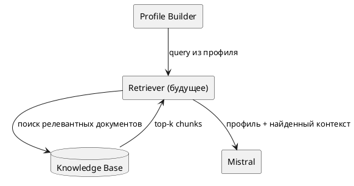

# AI Pipeline — Lab 2 / AI Engineer

## 1. Назначение

AI-часть проекта «Автоматизация ВКР с помощью ИИ» формирует кандидаты тем ВКР для направления
**09.03.01 «Информатика и вычислительная техника»** по профилю преподавателя и затем отдельно
проверяет качество результата.

Для MVP выбран не агент и не обязательный RAG, а детерминированный pipeline:

> профиль преподавателя → Mistral → Structured Output → локальный Quality Gate →
> semantic similarity → ручное подтверждение → экспорт.

Это решение продолжает вывод Lab 1: небольшой профиль преподавателя и его историю можно передать
непосредственно в prompt. RAG оставляется точкой расширения для большого внешнего корпуса:
методических документов, публикаций и архива ВКР.

---

## 2. Схема pipeline в PlantUML

```plantuml
@startuml
title AI pipeline генерации тем ВКР

actor "Администратор / кафедра" as User
participant "Frontend" as UI
participant "FastAPI\nAI API" as API
participant "Profile Builder" as Profile
participant "Mistral\nministral-8b-2512" as LLM
participant "Schema Validator" as Schema
participant "Quality Gate" as QG
participant "Local Embeddings\nFastEmbed/ONNX" as Emb
database "VKR DB" as DB

User -> UI: Выбирает преподавателей,\nколичество тем, focus
UI -> API: POST /api/generate/selected/stream

API -> DB: Загружает профиль преподавателя
DB --> API: research_areas,\npast topics, approved topics

API -> Profile: Формирует ограниченный контекст
Profile --> API: teacher payload

API -> LLM: prompt + JSON Schema\n(titles only)
LLM --> API: teacher_id + titles[]

API -> Schema: Проверка структуры JSON
Schema --> API: valid / invalid

alt structured output корректен
    API -> QG: Проверка формулировки и профиля
    QG -> Emb: Семантическая проверка дублей
    Emb --> QG: similarity scores
    QG --> API: passed / review / blocked
    API -> DB: Сохраняет темы + provenance + quality metadata
    API --> UI: NDJSON progress / final
else ошибка / timeout / 429
    API --> UI: Явная ошибка
    note right of API
      Локальный demo-банк
      НЕ подмешивается
      в AI-результат.
    end note
end

User -> UI: Ручная проверка
UI -> API: approve / edit / regenerate
API -> DB: Сохраняет решение

User -> UI: Экспорт
UI -> API: GET /api/export/xlsx
API -> QG: Полный similarity recheck
QG -> Emb: Локальная проверка
API -> DB: Только approved topics
API --> UI: XLSX:
Преподаватель | Тема | ФИО студента

@enduml
```

---

## 3. Что видит модель

В Mistral передаётся только контекст, необходимый для генерации темы:

- направление подготовки `09.03.01`;
- `teacher_id`;
- ФИО преподавателя;
- кафедра и должность;
- `scientific_areas`;
- локально вычисленные `dominant_profile_directions`;
- до 10 прошлых одобренных тем преподавателя;
- уже утверждённые темы преподавателя;
- до 20 тем, которых следует избегать;
- пожелание администратора `generation_focus`, если оно задано;
- несколько эталонных тем только как пример уровня конкретики.

### Модель не видит

- Mistral API key;
- Google Service Account и другие секреты;
- ФИО и контакты студентов;
- телефон / Telegram / e-mail преподавателя, если они не нужны генерации;
- всю базу ВКР целиком;
- локальные embedding-векторы;
- внутренние пороги Quality Gate;
- доступ к БД или файловой системе;
- возможность самостоятельно выполнять внешние действия.

Таким образом LLM является **генератором кандидатов**, а не автономным агентом с правами в системе.

---

## 4. Формат structured output

Основной AI-вызов специально минимален: модель возвращает только идентификатор преподавателя
и названия кандидатов.

```json
{
  "teachers": [
    {
      "teacher_id": 84,
      "titles": [
        "Разработка многоагентной системы управления проектами с распределением задач и прогнозированием сроков",
        "Разработка системы анализа бизнес-процессов с выявлением узких мест и моделированием вариантов оптимизации"
      ]
    }
  ]
}
```

JSON Schema используется для того, чтобы не парсить свободный текст.

Документация Mistral по Structured Outputs:

- https://docs.mistral.ai/studio/conversations/structured-output
- https://docs.mistral.ai/studio/conversations/structured-output/custom

---

## 5. Этапы Quality Gate

### Q0. Проверка входа

До вызова модели:

- преподаватель существует;
- `count` находится в допустимом диапазоне;
- один преподаватель не повторяется в selection;
- профиль нормализован.

### Q1. Проверка structured output

После Mistral:

- JSON соответствует схеме;
- `teacher_id` совпадает с запросом;
- список `titles` существует;
- пустые и повреждённые элементы не принимаются.

### Q2. Проверка технической формулировки

Название должно:

- описывать разработку программного продукта;
- соответствовать 09.03.01;
- объяснять, что создаётся и для какой задачи;
- содержать содержательную функцию;
- не быть слишком коротким или абстрактным.

### Q3. Профильная релевантность

Проверяются:

- заявленные `research_areas`;
- направления, выведенные из прошлых тем;
- возможное попадание в чужое направление.

Результат сохраняется как score и список причин.

### Q4. Проверка дублей

Сравнение выполняется локально:

1. exact duplicate;
2. multilingual embeddings через FastEmbed/ONNX;
3. если embedding-модель недоступна — честный lexical fallback со своей шкалой.

Проверяется сходство:

- с прошлыми темами преподавателя;
- со всей исторической базой;
- с темами текущего набора.

### Q5. Human-in-the-loop

Финальное решение принимает человек:

- `draft`;
- `approved`;
- `rejected`.

AI не утверждает тему самостоятельно.

### Q6. Повторная проверка перед экспортом

Перед XLSX / Google Sheets similarity пересчитывается ещё раз.
В итоговую таблицу попадают только утверждённые темы.

---

## 6. Логирование

Для каждого AI-вызова необходимо логировать:

| Поле | Для чего |
|---|---|
| `batch_id` / correlation id | связать события одного запуска |
| `teacher_id` | определить запрос без лишних персональных данных |
| `model` | воспроизводимость и сравнение качества |
| `prompt_version` | понимать, какой prompt дал результат |
| `requested_topics` | контроль полноты |
| `candidate_count` | анализ AI-repair |
| `attempt` | диагностика retry |
| `http_status` | 429 / 5xx / другие ошибки |
| `latency_ms` | контроль задержки |
| `prompt_tokens` | стоимость |
| `completion_tokens` | стоимость |
| `generation_source` | Mistral / demo |
| `quality_state` | passed / review / blocked |
| similarity method + score | воспроизводимость Quality Gate |

### Что не логируем

- API keys;
- service-account JSON;
- пароли;
- полные тексты ВКР;
- лишние персональные данные;
- полный prompt в production-логе по умолчанию.

Для отладки допускается отдельный защищённый trace с ограниченным сроком хранения.

---

## 7. Ошибки и деградация

### Mistral timeout / 429 / 5xx

1. выполняются ограниченные retry;
2. если основной AI-запрос не завершён — операция возвращает явную ошибку;
3. встроенный demo-банк **не подмешивается**;
4. пользователь может повторить запрос;
5. дешёвая модель используется только в явно включённом degraded mode.

### Деградация модели

Основная модель:

`ministral-8b-2512`

Дешёвая модель:

`ministral-3b-2512`

Деградация не должна быть скрытой:

- источник и фактическая модель сохраняются;
- темы остаются черновиками;
- ручная проверка обязательна;
- по умолчанию модели не смешиваются в одном batch, чтобы качество можно было сравнивать.

### Локальные embeddings недоступны

Pipeline не падает:

- включается `local-lexical`;
- применяются отдельные более низкие пороги;
- метод проверки сохраняется рядом со score.

---

## 8. Границы RAG

В MVP retrieval перед генерацией **не используется**.

Точка подключения RAG предусмотрена между Profile Builder и Mistral:



RAG добавляется только когда генератору понадобится контекст, который уже нельзя безопасно и
предсказуемо передать напрямую: публикации, методички, большой архив ВКР.

---

## 9. Основные метрики pipeline

Для Lab 2 фиксируются следующие наблюдаемые метрики:

- доля запросов, завершившихся без AI-repair;
- доля тем `passed / review / blocked`;
- доля недобора относительно запрошенного количества;
- latency на одного преподавателя;
- prompt / completion tokens;
- стоимость batch;
- число similarity warnings;
- число тем, изменённых или отклонённых человеком.

Эти метрики позволяют в следующих лабораторных сравнивать prompt, модели и Quality Gate не по впечатлению,
а по измеряемому результату.

---

## 10. Итог

AI pipeline MVP:

> **Ministral 3 8B + компактный Structured Output + локальный Quality Gate +
> локальные multilingual embeddings + human-in-the-loop.**

Pipeline не даёт LLM внешних прав, не маскирует сбой AI локальной подстановкой и сохраняет provenance
каждой темы.
